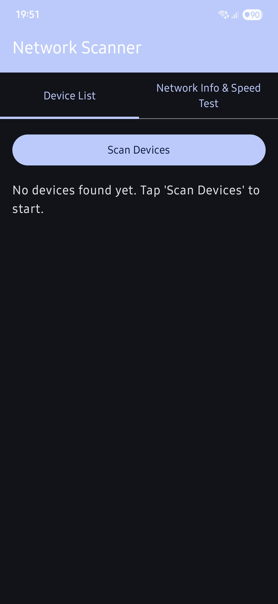
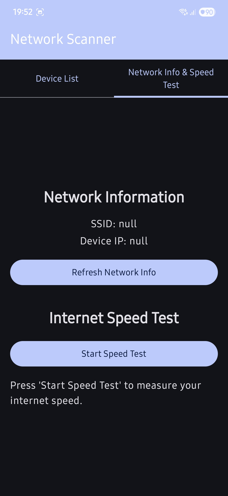

Webly Network Tool

Webly is an Android application designed to provide essential network information and diagnostic tools for your device. Get insights into your local network, scan for connected devices, and measure your internet speed (ping and download).

Here are some screenshots of the WatchList app:
 

Features

    Device IP & Wi-Fi SSID: Quickly see your device's current IP address and the Wi-Fi network name you're connected to.

    Network Device Scanner: Scan your local network to discover other connected devices, displaying their IP addresses and hostnames.

    Internet Speed Test: Measure your internet connection's performance with a built-in ping test and download speed test (in Mbps).

Technologies Used

    Kotlin: Primary programming language for Android development.

    Jetpack Compose: Modern toolkit for building native Android UI.

    Android Architecture Components: ViewModel, LiveData for robust and testable app architecture.

    Coroutines: For asynchronous operations and network calls.

    OkHttp: For efficient HTTP client operations (used in speed test).

Installation

To run this project locally, you'll need Android Studio installed.

    Clone the repository:
    Bash

    git clone https://github.com/cleppy/webly.git

    Open in Android Studio:
    Open the cloned project in Android Studio.

    Build and Run:
    Sync Gradle, then run the application on an Android emulator or a physical device. Ensure you grant necessary Location and Nearby Devices permissions when prompted.

Contributing

Feel free to fork the repository, make improvements, and submit pull requests.

License

This project is open-source and available under the MIT License.
